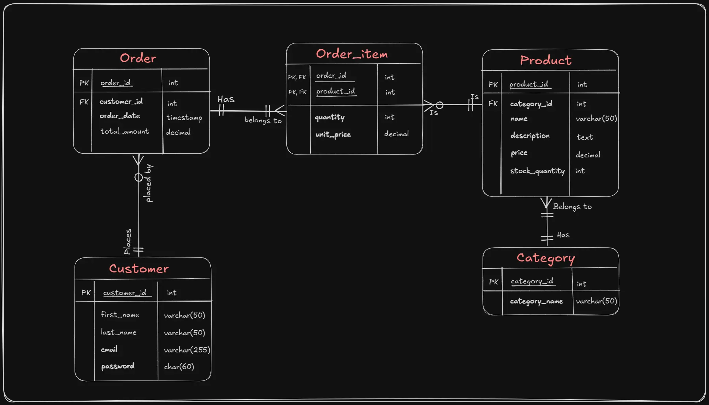

# E-commerce-Store-DB
This is the database deign, schema script, and queries optimization for a general e-commerce store

### 🗂️ Entity Relationship Diagram



### 📄 Database Schema & Query Scripts

You can view the full schema in [`store-schema.sql`](./assets/store-schema.sql).  
You can view the full queries in [`store-queries.sql`](./assets/store-queries.sql).

To run and test the queries, here's the sample data files
[`small_data_set-1000orders.sql`](./assets/order_data-1000records.sql),
[`large_data_set-10000orders.sql`](./assets/order_data-10000records.sql).

### 📚 Queries Table of Contents
	🔎 1. SQL query to generate a daily report of the total revenue for a specific date

	🎯 2. SQL query to generate a monthly report of the top-selling products in a given month

	💰 3. SQL query to retrieve a list of customers who have placed orders totaling more than $500 in the past month

	📅 4. SQL query to search for all products with the word "camera" in either the product name or description.

	👥 5. SQL query to suggest popular products in the same category for the same author excluding the purchased product from the recommendations?


### 📊 Query Optimizations

reports (daily, monthly, and customer-based) queries using normalized VS denormalized tables

- **Summary Tables**:  
  `daily_report` and `monthly_report` store pre-aggregated results to enable faster and more efficient reporting queries.

- **Denormalized Views**:  
  `customer_orders` simplifies joins across `customer`, `order` to improve performance.

### Summary tables 
```sql
-- SUMMARY TABLE FOR THE DAILY REVENUE
CREATE TABLE daily_report(
	order_date DATE NOT NULL PRIMARY KEY,
	revenue DECIMAL(12, 2)
);

-- SUMMARY TABLE FOR THE MONTLY TOP SELLING 5 PRODUCTS (PER UNITS)
CREATE TABLE monthly_report(
	sale_month DATE,
    product_id INT,
    product_name VARCHAR(50),
    total_quantity INT UNSIGNED,

    PRIMARY KEY(sale_month, product_id)
);
```

<details>
<summary> 🔄 How Summary Tables Are Populated and Refreshed</summary>

### 🟢 Initial Data Loading (One-Time Setup)

These are run manually once to initialize the tables with historical data.

#### ✅ Populate `daily_report` with historical daily revenue:

```sql
INSERT INTO daily_report(order_date, revenue)
SELECT
    order_date,
    SUM(total_amount) AS total_amount
FROM `order`
GROUP BY order_date
ORDER BY order_date;
```

#### ✅ Populate `monthly_report` with top 5 products by month (historically):

```sql
INSERT INTO monthly_report(sale_month, product_id, product_name, total_quantity)
SELECT
	STR_TO_DATE(CONCAT(sale_month, '-01'), '%Y-%m-%d') AS sale_month,
	product_id,
	product_name,
	total_quantity
FROM (
	SELECT
		DATE_FORMAT(o.order_date, '%Y-%m') AS sale_month,
		p.id AS product_id,
		p.name AS product_name,
		SUM(oi.quantity) AS total_quantity,
		ROW_NUMBER() OVER (
			PARTITION BY DATE_FORMAT(o.order_date, '%Y-%m')
			ORDER BY SUM(oi.quantity) DESC
		) AS rn
	FROM product p
	JOIN order_item oi ON p.id = oi.product_id
	JOIN `order` o ON o.id = oi.order_id
	GROUP BY sale_month, p.id
) AS monthly_product_sales
WHERE rn <= 5;
```

---

### 🔁 Daily Refresh via Stored Procedures + Events

Scheduled events call the stored procedures daily at `04:00 AM` to update with fresh data.

---

### ⚙️ Stored Procedures

#### 🔄 Refresh `daily_report` with yesterday’s revenue:

```sql
DELIMITER //
CREATE PROCEDURE refresh_daily_report()
BEGIN 
    INSERT INTO daily_report(order_date, revenue) 
	SELECT 
		order_date, 
        SUM(total_amount) AS total_amount
	FROM `order`
	WHERE order_date = DATE_SUB(CURRENT_DATE, INTERVAL 1 DAY)
	GROUP BY order_date;
END //
DELIMITER ;
```

#### 🔄 Refresh `monthly_report` with current month's top 5 products:

```sql
DELIMITER //
CREATE PROCEDURE refresh_monthly_report()
BEGIN
	-- Clear this month’s previous data
	DELETE FROM monthly_report
	WHERE sale_month = DATE_FORMAT(CURRENT_DATE, '%Y-%m-01');

	-- Insert updated top 5 products for the current month
	INSERT INTO monthly_report (sale_month, product_id, product_name, total_quantity)
	SELECT
		DATE_FORMAT(o.order_date, '%Y-%m-01') AS sale_month,
		p.id AS product_id,
		p.name AS product_name,
		SUM(oi.quantity) AS total_quantity
	FROM product p INNER JOIN order_item oi
	ON p.id = oi.product_id
	INNER JOIN `order` o ON o.id = oi.order_id
	WHERE o.order_date >= DATE_FORMAT(CURRENT_DATE, '%Y-%m-1')
          AND o.order_date < DATE_FORMAT(DATE_ADD(CURRENT_DATE, INTERVAL 1 MONTH), '%Y-%m-1')
	GROUP BY sale_month, p.id;
END //
DELIMITER ;
```

---

### ⏰ Scheduled Events

#### 📆 Daily Event for Monthly Report Refresh:

```sql
CREATE EVENT refresh_monthly_report_event
ON SCHEDULE EVERY 1 DAY
-- Starts tomorrow at 4:00 AM
STARTS TIMESTAMP(CURRENT_DATE + INTERVAL 1 DAY + INTERVAL '04:00:00' HOUR_SECOND)
DO
	CALL refresh_monthly_report();
```

#### 📆 Daily Event for Daily Report Refresh:

```sql
CREATE EVENT refresh_daily_report_event
ON SCHEDULE EVERY 1 DAY
-- Starts tomorrow at 4:00 AM
STARTS TIMESTAMP(CURRENT_DATE + INTERVAL 1 DAY + INTERVAL '04:00:00' HOUR_SECOND)
DO
	CALL refresh_daily_report();
```
</details>

----

### ⚙️ Query Optimization Comparisons (around 1000 orders)

Each section below compares the **original query** with its **optimized version**, and includes performance insights using `EXPLAIN ANALYZE`.


### 💰  1. Daily Revenue Report

#### Sample output
```sql
| order_date | revenue   |
|------------|-----------|
| 2024-01-10 | 30248.92  |
```

#### 🔍 Original Query

```sql
SELECT order_date, SUM(total_amount) AS total_amount
FROM `order`
WHERE order_date = '2024-01-10' -- This's just an example date
GROUP BY order_date;
```

#### ⚡ Improved Query

```sql
SELECT order_date, revenue
FROM daily_report
WHERE order_date = '2024-01-10'; -- This's just an example date
```

#### 📊 Performance Comparison

<details>
<summary>View the performance comparison results</summary>

Using the summary table provides two main advantages:

1. **Aggregation is precomputed**, so the query skips the ```SUM()``` operation.

2. **Efficient indexing**: It leverages the summary table's primary key index directly, avoiding two index lookups (```order_date index``` -> ```primary key index```) required by the original query.


**Before Optimization:**

```
-- Execution Time: 0.0245 sec
-> Group aggregate: sum(`order`.total_amount)  (cost=0.9 rows=1.41) (actual time=0.0237..0.0238 rows=1 loops=1)
    -> Index lookup on order using order_date (order_date=DATE''2024-01-10'')  (cost=0.7 rows=2) (actual time=0.0185..0.0202 rows=2 loops=1)
```

**After Optimization (using summary table):**

```
-- Execution Time: 128e-6 sec
-> Rows fetched before execution  (cost=0..0 rows=1) (actual time=90e-6..164e-6 rows=1 loops=1)
```

</details>

---

### 📅 2. Monthly Top Selling Products

#### Sample output
```sql
| sale_month | product_id | product_name      | total_quantity |
|------------|------------|-------------------|----------------|
| 2022-01-01 | 25         | Wireless Mouse    | 124            |
| 2022-01-01 | 74         | Gaming Keyboard   | 119            |
| 2022-01-01 | 72         | USB-C Cable       | 102            |
| 2022-01-01 | 75         | USB-C Cable2      | 90             |
| 2022-01-01 | 90         | USB-C Cable3      | 80             |
```

#### 🔍 Original Query

```sql
SELECT
	DATE_FORMAT('2022-01-01', '%Y-%m-01') AS sale_month,
    p.id AS product_id,
    p.name AS product_name,
    SUM(quantity) as total_quantity
FROM product p INNER JOIN order_item oi
ON p.id = oi.product_id
INNER JOIN `order` o ON o.id = oi.order_id
WHERE o.order_date >= '2022-01-01' AND o.order_date < '2022-02-01' -- This's just an example date
GROUP BY p.id
ORDER BY total_quantity DESC
LIMIT 5;
```

#### ⚡ Improved Query

```sql
SELECT *
FROM monthly_report
WHERE sale_month = '2022-01-01' -- This's just an example date
ORDER BY total_quantity DESC;
```

#### 📊 Performance Comparison

<details>
<summary>View the performance comparison results</summary>

Using the `monthly_report` summary table provides two main advantages:

1. **Aggregation is precomputed**, so the query skips the ```SUM()``` operation.

2. **The triple join is skipped**: join between `product`, `order`, `order_item` tables is skipped

3. **Efficient indexing**: It leverages the summary table's primary key index directly

4. **Avoids the sorting**: The index is already sorted by total quantity

**Before Optimization:**

```
-- Execution Time: 0.669 sec
-> Limit: 5 row(s)  (actual time=0.667..0.669 rows=5 loops=1)
    -> Sort: total_quantity DESC, limit input to 5 row(s) per chunk  (actual time=0.666..0.667 rows=5 loops=1)
        -> Table scan on <temporary>  (actual time=0.627..0.635 rows=37 loops=1)
            -> Aggregate using temporary table  (actual time=0.626..0.626 rows=37 loops=1)
                -> Nested loop inner join  (cost=54.8 rows=74.5) (actual time=0.056..0.48 rows=68 loops=1)
                    -> Nested loop inner join  (cost=28.7 rows=74.5) (actual time=0.047..0.304 rows=68 loops=1)
                        -> Filter: ((o.order_date >= DATE''2022-01-01'') and (o.order_date < DATE''2022-02-01''))  (cost=6.27 rows=30) (actual time=0.0319..0.0594 rows=30 loops=1)
                            -> Covering index range scan on o using order_date over (''2022-01-01'' <= order_date < ''2022-02-01'')  (cost=6.27 rows=30) (actual time=0.0291..0.0419 rows=30 loops=1)
                        -> Index lookup on oi using PRIMARY (order_id=o.id)  (cost=0.508 rows=2.48) (actual time=0.00554..0.0077 rows=2.27 loops=30)
                    -> Single-row index lookup on p using PRIMARY (id=oi.product_id)  (cost=0.251 rows=1) (actual time=0.00231..0.00235 rows=1 loops=68)
```

**After Optimization:**

```
-- Execution Time: 0.0288 sec
-> Index lookup on monthly_report using PRIMARY (sale_month=DATE''2022-01-01'')  (cost=0.751 rows=5) (actual time=0.0227..0.0288 rows=5 loops=1)
```


</details>

---

### 👥 3. A list of customers who have placed orders totaling more than $500 in the past month

#### 🔍 Original Query

```sql
SELECT CONCAT(c.first_name, ' ', c.last_name) AS customer_name, SUM(o.total_amount) AS total_amount
FROM `order` o JOIN  customer c
ON c.id = o.customer_id
WHERE
	o.order_date >= DATE_FORMAT(CURRENT_DATE - INTERVAL 1 MONTH, '%Y-%m-01') AND
    o.order_date < DATE_FORMAT(CURRENT_DATE, '%Y-%m-01')
GROUP BY c.id
HAVING total_amount > 500;
```

#### ⚡ Improved Query

```sql
SELECT CONCAT(co.first_name, ' ', co.last_name) AS customer_name, SUM(co.total_amount) AS total_amount
FROM customer_orders co
WHERE
	co.order_date >= DATE_FORMAT(CURRENT_DATE - INTERVAL 1 MONTH, '%Y-%m-01') AND
    co.order_date < DATE_FORMAT(CURRENT_DATE, '%Y-%m-01')
GROUP BY co.customer_id, customer_name
HAVING total_amount > 500;
```
---

### 📊 Performance Comparison


The performance impact of using a denormalized table (`customer_orders`) versus performing a join (`order` ⨝ `customer`) varies with data size.

#### 🔹 Small Dataset Test

*(1,000 orders, 100 customers)*

* The **join cost is minimal**, and performance between the two approaches is nearly identical.

**▶ With Join:**

```
Execution time: 0.153s
-> Filter: (total_amount > 500)  (actual time=0.148..0.153 rows=21 loops=1)
    -> Table scan on <temporary>  (actual time=0.145..0.148 rows=26 loops=1)
        -> Aggregate using temporary table  (actual time=0.144 rows=26 loops=1)
            -> Nested loop inner join
                -> Index range scan on o using order_date
                -> Single-row index lookup on c using PRIMARY (loops=30)
```

**▶ With Denormalized Table:**

```
Execution time: 0.163s
-> Filter: (total_amount > 500)  (actual time=0.157..0.163 rows=21 loops=1)
    -> Table scan on <temporary>  (actual time=0.154..0.157 rows=26 loops=1)
        -> Aggregate using temporary table
            -> Index range scan on co using order_date
```

#### 🔹 Large Dataset Test

*(10,000 orders, 500 customers)*

* The **join cost becomes noticeable** due to the growing number of nested lookups.
* The **denormalized table outperforms** the join-based approach by avoiding those extra lookups.

**▶ With Join:**

```
Execution time: 2.50s
-> Filter: (total_amount > 500)  (actual time=2.39..2.50 rows=234 loops=1)
    -> Table scan on <temporary>  (actual time=2.39..2.44 rows=249 loops=1)
        -> Aggregate using temporary table
            -> Nested loop inner join
                -> Index range scan on o using order_date (360 rows)
                -> Single-row index lookup on c using PRIMARY (360 loops)
```

**▶ With Denormalized Table:**

```
Execution time: 2.14s
-> Filter: (total_amount > 500)  (actual time=2.08..2.14 rows=234 loops=1)
    -> Table scan on <temporary>  (actual time=2.08..2.11 rows=249 loops=1)
        -> Aggregate using temporary table
            -> Index range scan on co using order_date
```

---

### ✅ Conclusion

* On **small datasets**, the join overhead is negligible, and both approaches perform similarly.
* On **larger datasets**, the denormalized table **significantly reduces query execution time** by eliminating join operations and reducing random I/O.

### 🔎 4. Search for all products with the word "camera" in either the product name or description.
```sql
ALTER TABLE product ADD FULLTEXT INDEX `fulltext`(name, description);

SELECT id, name, price, description
FROM product
WHERE MATCH(name, description) AGAINST ('camera');
```

### 🔎 5. Suggest popular products in the same category for the same author, excluding the purchased product from the recommendations
```sql
SELECT p.id, p.name, SUM(quantity) AS sales_count
FROM product p 
JOIN order_item oi ON oi.product_id = p.id
WHERE id <> 20 AND (category_id, author_id) IN ( 
	SELECT category_id, author_id
	FROM product
	WHERE id = 20
)
GROUP BY p.id, p.name
ORDER BY sales_count DESC
LIMIT 10;
```